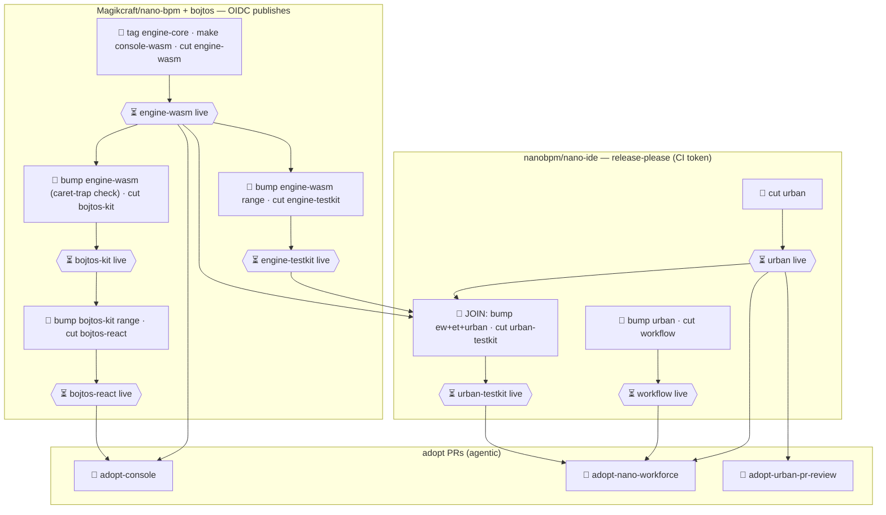

# wasm-engine-release-graph

A **reusable, version-controlled [Nano Workforce](https://nanobpm.io) delivery graph** that
orchestrates a coordinated release across the nano ecosystem: the WASM engine
(`@nanobpm/engine-wasm`) and everything downstream of it, with each package's dependency bump
applied **in topological order** and every cross-repo publish gated on the upstream actually being
live on the registry.

This repo is **the process, as data**. The graph is authored once
([`graph/release-graph.json`](graph/release-graph.json)), checked in, reviewed like code, and
re-run every release — as opposed to Nano Workforce's built-in processes (merge-loop, convergence,
plan-fanout) or its *one-shot* ad-hoc delivery graphs. It is the reference example of a
**user-supplied, repeating delivery graph**.

## Why this exists

The nano ecosystem roots in one Rust crate and fans out through **three different release systems**:

| Train | Repo | Mechanism | Publishes |
|---|---|---|---|
| engine / bojtos | `Magikcraft/nano-bpm` + `nanobpm/bojtos` | tag + `bojtos-release.mjs` (**OIDC** trusted publishing) | `engine-wasm`, `engine-testkit`, `bojtos-kit`, `bojtos-react` |
| urban | `nanobpm/nano-ide` | release-please (CI token) | `urban`, `workflow`, `urban-testkit` |
| apps | `nano-workforce`, `console`, `urban-pr-review` | semantic-release / adopt PRs | the sinks |

All three trains now publish via **OIDC / CI tokens** — no interactive OTP — so every publish is
automatable. The graph is therefore **fully agentic**; the human-in-the-loop is the single
approval-token gate at dispatch (below), not a per-publish stop.

Cutting a coordinated release is **not** just tagging — it is bumping each downstream dependency
**range** in the right order and *proving the range resolves to the new upstream* before publishing
the next layer. On `0.x`, `^0.3.0` means `>=0.3.0 <0.4.0`, so a minor bump silently strands
consumers (this is a live problem: `bojtos-kit` pins `engine-wasm ^0.3.0` while `0.8.0` is
published). This graph encodes that ordering and those gates so the sequence is reproducible instead
of tribal knowledge.

## Prior art / lineage

This is the realisation of a design its author first sketched in 2020:
[*Complex multi-repo builds with GitHub Actions and Camunda Cloud*](https://medium.com/@sitapati/complex-multi-repo-builds-with-github-actions-and-camunda-cloud-fa8e4c7abd26).
That article named the exact problem this repo solves — *"how do I trigger a test run for downstream
dependent packages when I publish a new image of the core API?"* — and rejected the exact
anti-pattern (`repository_dispatch` webhooks: *"the rabbit hole of peer-to-peer choreography, with an
attendant loss of visibility"*) in favour of a single orchestrating model: **"executable
documentation of the system architecture that cannot go out of date."** That phrase is precisely
what [`graph/release-graph.json`](graph/release-graph.json) is.

What changed in six years is the substrate. The 2020 version bridged GitHub to **Camunda Cloud /
Zeebe** over REST, with a bespoke [Zeebe GitHub Action](https://github.com/jwulf/zeebe-action) and
message-correlation on a `buildid`. Here the orchestrator is a `DeliveryGraph` compiled to native
BPMN running on the in-repo **WASM engine** — `agent` nodes in place of `repository_dispatch`
callbacks, `wait` / npm-readiness probes in place of correlation messages, and the model itself is
the versioned deliverable rather than a Modeler diagram that drifts. Same thesis; no external cloud,
no REST bridge, no stale drawing.

## The graph

10 `agent` (automated release + adopt work) · 7 `wait` (npm registry-propagation gates) · 0
`human` — every publish is OIDC/CI-token, so the whole runbook is automatable. Rendered view —
[`docs/graph.mmd`](docs/graph.mmd):



### Node kinds

- **🤖 `agent`** — a `senior:*` worker job does the work (bump the upstream range, catch the caret
  trap, build + test, cut/publish via OIDC, or open the downstream adopt PR). Side-effecting.
- **⏳ `wait`** — a durable `npm` readiness probe: block the next cut until the upstream version is
  actually resolvable on the registry (the propagation-lag guard). Emits an `artifact` fact.
- **🧑 `human`** — a scheduled user task. Not used here (every publish is automatable), but part of
  the vocabulary: use it for any step that genuinely needs a person, answerable by a human *or* an
  agent.

Every `agent`/`connector` node is a **side effect**, so the whole graph is **parked at approval**
until dispatched with its content-addressed approval token (see below) — that single gate is the
human-in-the-loop.

## Working with the graph

```bash
npm install
npm run schema     # (re)derive schema/ from nano-workforce's openapi.yaml (single source of truth)
npm run validate   # offline SHAPE gate (Ajv) — structure only
npm run render     # regenerate docs/graph.mmd from the graph
npm run check      # validate + assert docs/graph.mmd is up to date (what CI runs)
```

The offline shape-gate is **necessary, not sufficient**: the authoritative **semantic** validation
(acyclic DAG, no dangling edges, every `<node>.<fact>` endpoint resolves) lives in Nano Workforce's
`validateDeliveryGraph` and runs at dispatch. To exercise it — and to preview/launch the run —
point at a running Merlin instance:

```bash
MERLIN_URL=http://127.0.0.1:3000 npm run preview     # validate + compile + show diagram/stops/effects (no side effects)
MERLIN_URL=http://127.0.0.1:3000 npm run dispatch    # preview, then launch with the approval token
```

`preview` posts to `actions/delivery-graph/preview`; `dispatch` posts to `actions/delivery-graph/dispatch`
digest as approval. A re-dispatch with the same graph is idempotent (short-circuits onto the
in-flight run).

## Single source of truth / no drift

- [`graph/release-graph.json`](graph/release-graph.json) is the **only** hand-authored artifact.
- [`schema/delivery-graph.schema.json`](schema/delivery-graph.schema.json) and
  [`docs/graph.mmd`](docs/graph.mmd) are **derived** — regenerated by `scripts/extract-schema.mjs`
  (from nano-workforce's `openapi.yaml`) and `scripts/render.mjs` respectively. CI git-diffs them,
  so a stale artifact fails the build instead of drifting.
- The schema is *extracted* from the upstream contract, never hand-copied — when the DeliveryGraph
  vocabulary moves, re-run `npm run schema` and commit.

## License

MIT — see [LICENSE](LICENSE).
